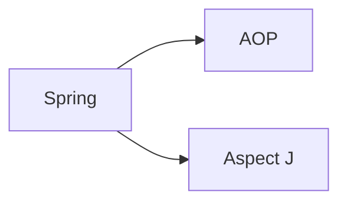

# awsprep
AWS Concepts &amp; Exam prep

VPC & Networking : https://www.itdiversified.com/aws-certified-advanced-networking-prep-vpc/

# Spring
Spring Framework: An unorthodox guide: https://www.marcobehler.com/guides/spring-framework

## Spring Aspect
Spring’s Proxy Facilities
Because under the hood, any Spring @Bean method can return you something that looks and feels like (in your case) a UserService, but actually isn’t.

It can return you a proxy.

The proxy will at some point delegate to the UserService you wrote, but first, will execute its own functionality.

spring clig proxies
More specifically, Spring will, by default, create dynamic Cglib proxies, that do not need an interface for proxying to work (like JDK’s internal proxy mechanism): Instead, Cglib can proxy classes through subclassing them on the fly.

Spring AOP Proxy vs AspectJ Proxy
Apart from what others have stated - just to rephrase, `there are two major differences`:

1. One is related to the type of weaving.
2. Another to the joinpoint definition.

**Spring-AOP:** Runtime weaving through proxy using concept of `dynamic proxy if interface exists or cglib library if direct implementation provided.`

**AspectJ:** Compile time weaving through `AspectJ Java Tools(ajc compiler)` if source available or post compilation weaving (using compiled files). Also, load time weaving with Spring can be enabled - it needs the `aspectj` definition file and offers flexibility.

Compile time weaving can offer benefits of performance (in some cases) and also the `joinpoint definition in Spring-aop is restricted to method definition only which is not the case for AspectJ.`

An additional note: **If performance under high load is important, you'll want AspectJ which is 9-35x faster than Spring AOP**. 10ns vs 355ns might not sound like much, but I've seen people using LOTS of Aspects. 10K's worth of aspects. In these cases, your request might hit a thousands of aspects. In that case you're adding ms to that request.
https://stackoverflow.com/questions/1606559/spring-aop-vs-aspectj

